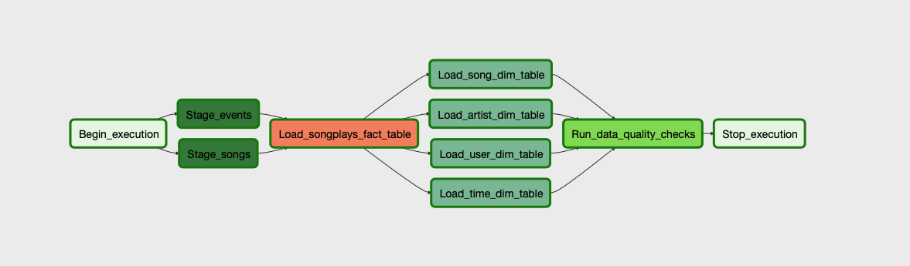

# [DEND-P4] Data Engineering Nanodegree - Project 4: Data Pipelines with Apache Airflow

## Introduction

_The content of the following section is from the project statement provided by Udacity._

>A music streaming company, Sparkify, has decided that it is time to introduce more automation and monitoring to their data warehouse ETL pipelines and come to the conclusion that the best tool to achieve this is Apache Airflow.
>
>They have decided to bring you into the project and expect you to create high grade data pipelines that are dynamic and built from reusable tasks, can be monitored, and allow easy backfills. They have also noted that the data quality plays a big part when analyses are executed on top the data warehouse and want to run tests against their datasets after the ETL steps have been executed to catch any discrepancies in the datasets.
>
>The source data resides in S3 and needs to be processed in Sparkify's data warehouse in Amazon Redshift. The source datasets consist of JSON logs that tell about user activity in the application and JSON metadata about the songs the users listen to.

## Project Datasets

_The content of the following section is from the project statement provided by Udacity._

>For this project, you'll be working with two datasets. Here are the s3 links for each:
>
>- Log data: `s3://udacity-dend/log_data`
>- Song data: `s3://udacity-dend/song_data`

## DAG

## License

**DISCLAIMER:** This project is part of the Data Engineering Nanodegree Program from Udacity. You must abide by [Udacity's Honor of Code](https://udacity.zendesk.com/hc/en-us/articles/210667103-What-is-the-Udacity-Honor-Code-), and in particular, you must submit your own work or attribute my code if you want to use part of my solution.

The project is released under the MIT License. See the [LICENSE.md](LICENSE.md) file for details.

Copyright (c) 2020 Nasseredine Bajwa

